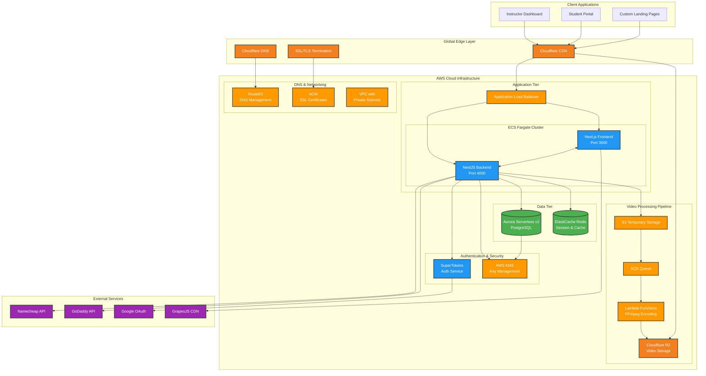
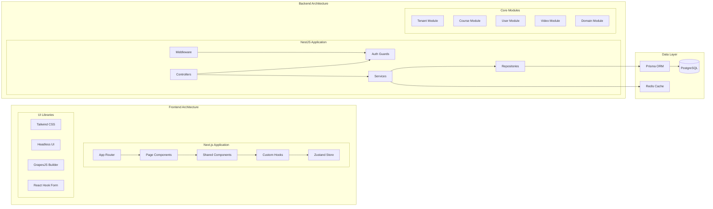
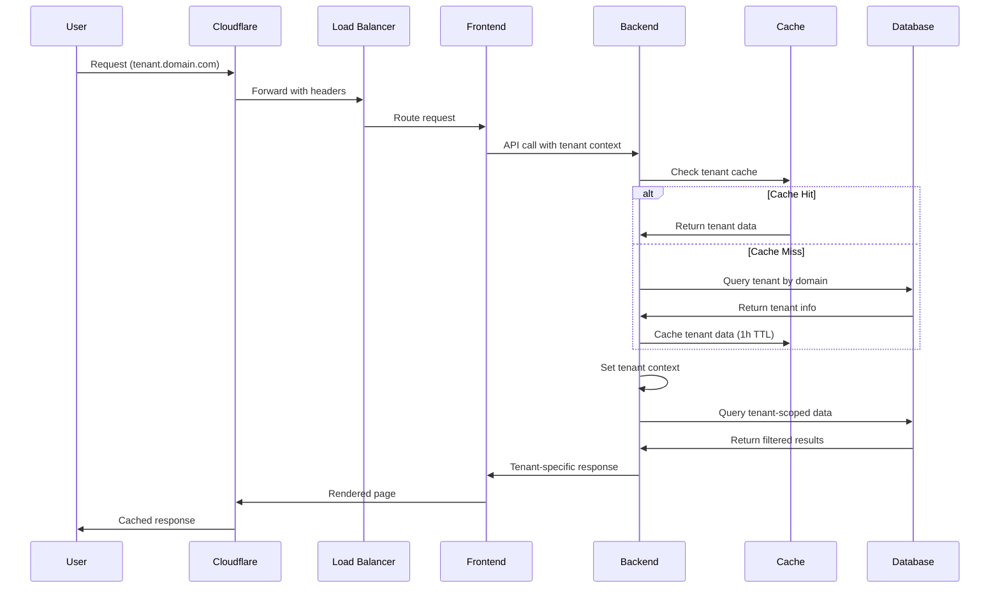
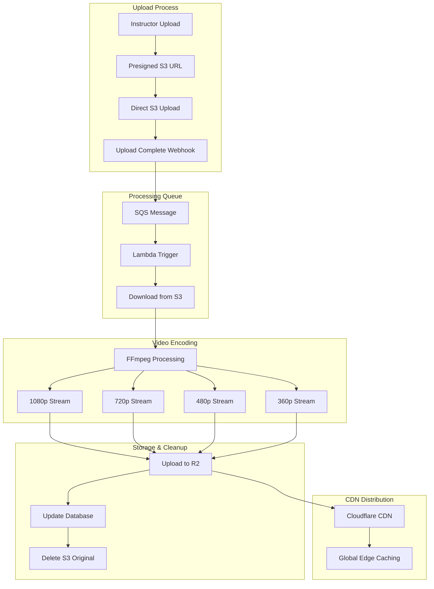
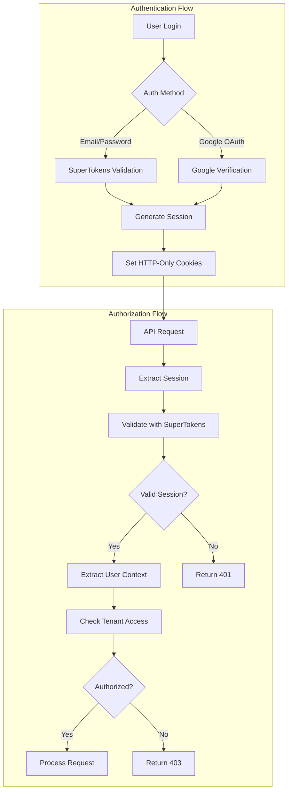
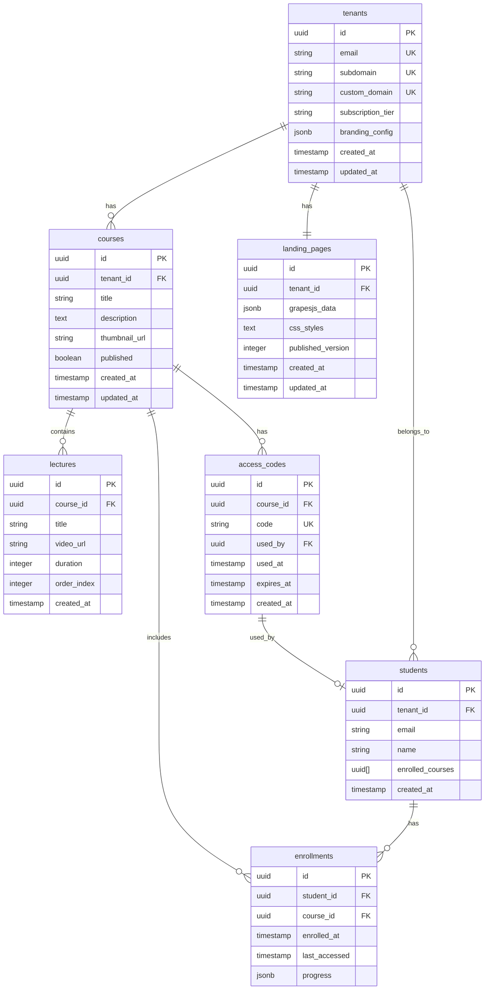
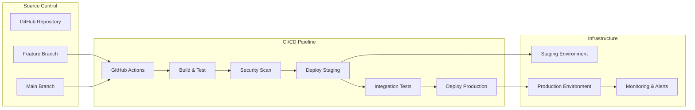
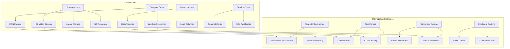

# System Architecture Diagrams

## High-Level System Architecture

## Detailed Component Architecture

## Multi-Tenant Data Flow

## Video Processing Pipeline

## Authentication & Authorization Flow

## Database Schema Relationships

## Infrastructure as Code Structure

```mermaid
graph TD
    subgraph "Terraform Modules"
        A[Root Module] --> B[VPC Module]
        A --> C[ECS Module]
        A --> D[Database Module]
        A --> E[Storage Module]
        A --> F[Security Module]
    end
    
    subgraph "VPC Module"
        B --> B1[Public Subnets]
        B --> B2[Private Subnets]
        B --> B3[NAT Gateway]
        B --> B4[Internet Gateway]
    end
    
    subgraph "ECS Module"
        C --> C1[Cluster]
        C --> C2[Task Definitions]
        C --> C3[Services]
        C --> C4[Load Balancer]
    end
    
    subgraph "Database Module"
        D --> D1[Aurora Cluster]
        D --> D2[Parameter Groups]
        D --> D3[Subnet Groups]
        D --> D4[Security Groups]
    end
    
    subgraph "Storage Module"
        E --> E1[S3 Buckets]
        E --> E2[R2 Configuration]
        E --> E3[Lambda Functions]
        E --> E4[SQS Queues]
    end
    
    subgraph "Security Module"
        F --> F1[KMS Keys]
        F --> F2[IAM Roles]
        F --> F3[Security Groups]
        F --> F4[SSL Certificates]
    end
```

## Deployment Pipeline

## Cost Optimization Strategy

