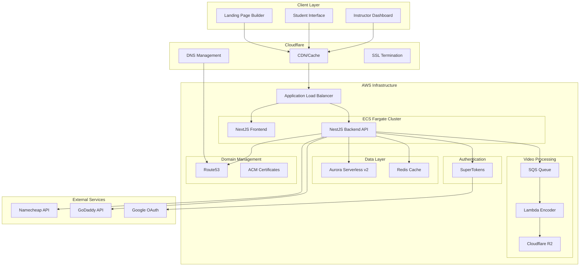
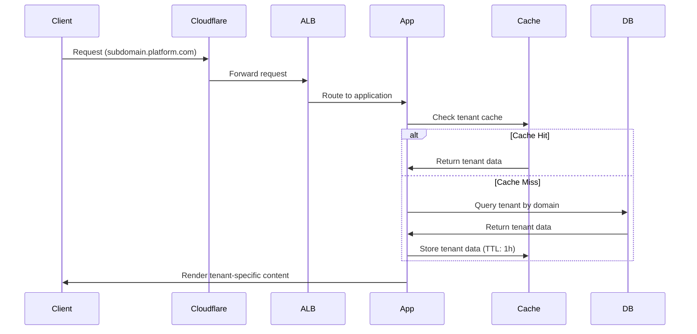
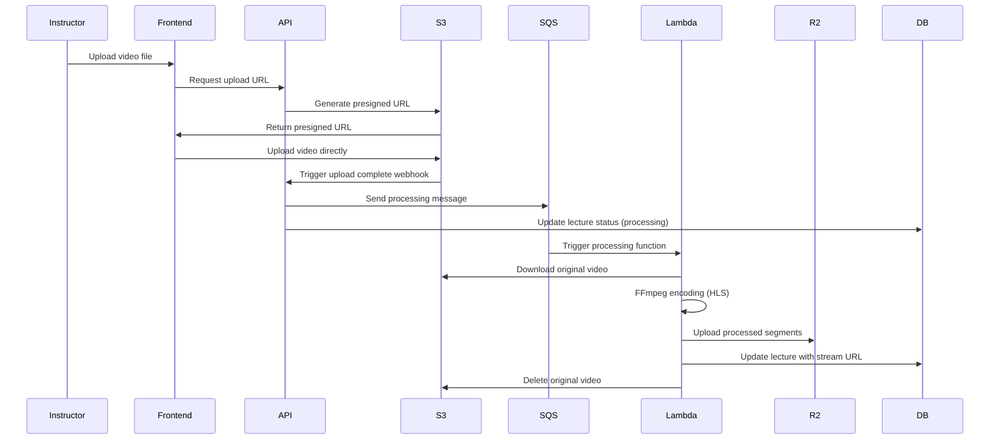
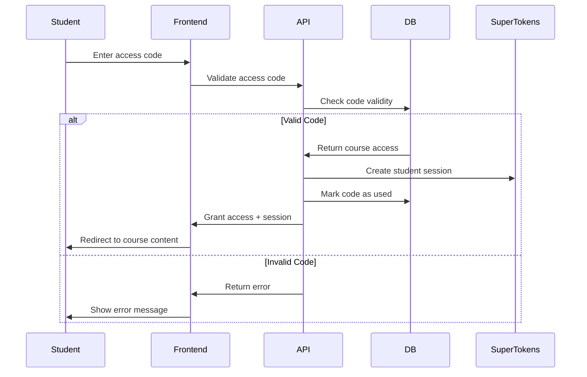
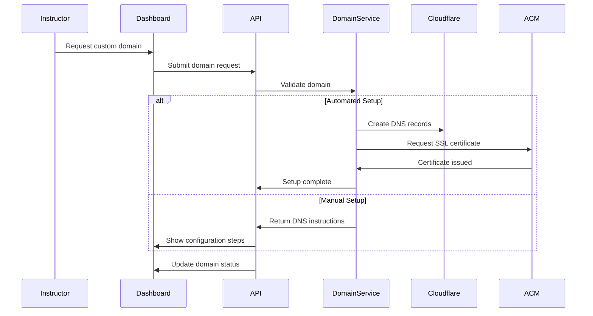

# Multi-Tenant Online Course Platform - Comprehensive System Design

## Executive Summary

This document outlines the complete system design, architecture, and implementation strategy for a multi-tenant online course platform built for cost-efficiency and ease of development. The platform enables instructors to create custom course websites with "one-click" setup while maintaining shared infrastructure for optimal cost management.

## Table of Contents

1. [System Overview](#system-overview)
2. [High-Level Architecture](#high-level-architecture)
3. [Technology Stack](#technology-stack)
4. [Core Features](#core-features)
5. [Database Design](#database-design)
6. [Request Flow & Workflows](#request-flow--workflows)
7. [Cost Analysis](#cost-analysis)
8. [Implementation Guide](#implementation-guide)
9. [Scaling Strategies](#scaling-strategies)
10. [Security Considerations](#security-considerations)

## System Overview

### Vision
Create a cost-effective, scalable multi-tenant platform that allows instructors to launch their own branded online course websites without technical expertise.

### Key Principles
- **Cost Efficiency**: Shared infrastructure with zero-egress video delivery
- **Simplicity**: Monolithic architecture for rapid development
- **Customization**: Full branding control for instructors
- **Performance**: Global CDN with intelligent caching

### Target Metrics
- **Free Tier**: 100 tenants, 5 courses each, 2 hours video per course
- **Premium Tier**: 300 tenants, 50-70 courses each, 1-8 hours video per course
- **Student Capacity**: 1K-50K active students per tenant

## High-Level Architecture



## Technology Stack

### Frontend Stack
- **Framework**: Next.js 14 (App Router)
- **Styling**: Tailwind CSS + Headless UI
- **Page Builder**: GrapesJS for landing page customization
- **State Management**: Zustand for client state
- **Forms**: React Hook Form + Zod validation

### Backend Stack
- **Framework**: NestJS with TypeScript
- **Database ORM**: Prisma with PostgreSQL
- **Authentication**: SuperTokens (self-hosted)
- **Validation**: Class Validator + Class Transformer
- **Documentation**: Swagger/OpenAPI

### Infrastructure
- **Compute**: AWS ECS Fargate
- **Database**: Aurora Serverless v2 (PostgreSQL)
- **Caching**: Redis ElastiCache
- **Video Storage**: Cloudflare R2
- **CDN**: Cloudflare
- **Queue**: AWS SQS
- **Video Processing**: AWS Lambda
- **DNS**: Cloudflare DNS + Route53

### Development Tools
- **Package Manager**: pnpm
- **Monorepo**: Nx workspace
- **Code Quality**: ESLint + Prettier
- **Testing**: Jest + Playwright
- **CI/CD**: GitHub Actions
- **Monitoring**: AWS CloudWatch + Sentry

## Core Features

### 1. Tenant Management System

#### Instructor Onboarding
- Email/password or Google OAuth registration
- Simple form-based platform setup
- Automated subdomain generation
- Basic branding configuration

#### Multi-tenancy Architecture
```typescript
// Tenant identification strategy
interface TenantContext {
  id: string;
  subdomain: string;
  customDomain?: string;
  brandingConfig: BrandingConfig;
  subscriptionTier: 'free' | 'premium';
}
```

### 2. Landing Page Builder

#### GrapesJS Integration
- Drag-and-drop interface
- Pre-built course platform templates
- Brand color palette inheritance
- Responsive design tools
- Asset management system

#### Caching Strategy
- Cloudflare edge caching for landing pages
- Cache invalidation on content updates
- CDN optimization for global performance

### 3. Course Management

#### Content Structure
```typescript
interface Course {
  id: string;
  tenantId: string;
  title: string;
  description: string;
  lectures: Lecture[];
  accessCodes: AccessCode[];
  published: boolean;
}

interface Lecture {
  id: string;
  courseId: string;
  title: string;
  videoUrl: string;
  duration: number;
  order: number;
}
```

#### Access Code System
- One-time use codes
- Instructor-generated codes
- Course-specific access
- Usage tracking and analytics

### 4. Video Processing Pipeline

#### Upload Flow
1. Instructor uploads video to temporary S3 bucket
2. SQS message triggers Lambda function
3. FFmpeg processes video into HLS segments
4. Segments stored in Cloudflare R2
5. Original video deleted from S3
6. Database updated with stream URL

#### Encoding Configuration
```yaml
Video Profiles:
  - 1080p: 5000 kbps
  - 720p: 3000 kbps  
  - 480p: 1500 kbps
  - 360p: 800 kbps

Audio: AAC, 128 kbps
Segments: 6 second HLS chunks
```

### 5. Authentication & Authorization

#### SuperTokens Implementation
- Session management
- Role-based access control
- Social login integration
- Tenant-scoped permissions

#### Permission Matrix
```typescript
enum Role {
  INSTRUCTOR = 'instructor',
  STUDENT = 'student',
  ADMIN = 'admin'
}

enum Permission {
  MANAGE_COURSES = 'manage_courses',
  VIEW_COURSES = 'view_courses',
  MANAGE_STUDENTS = 'manage_students',
  CUSTOMIZE_BRANDING = 'customize_branding'
}
```

### 6. Custom Domain Management

#### Manual Configuration
- DNS record instructions
- SSL certificate verification
- Domain validation process

#### Automated Configuration
- Namecheap/GoDaddy API integration
- Automatic DNS record creation
- SSL certificate provisioning via ACM

## Database Design

### Core Tables

```sql
-- Tenants table
CREATE TABLE tenants (
    id UUID PRIMARY KEY DEFAULT gen_random_uuid(),
    email VARCHAR(255) UNIQUE NOT NULL,
    subdomain VARCHAR(100) UNIQUE NOT NULL,
    custom_domain VARCHAR(255) UNIQUE,
    subscription_tier VARCHAR(20) DEFAULT 'free',
    branding_config JSONB,
    created_at TIMESTAMP DEFAULT NOW(),
    updated_at TIMESTAMP DEFAULT NOW()
);

-- Courses table
CREATE TABLE courses (
    id UUID PRIMARY KEY DEFAULT gen_random_uuid(),
    tenant_id UUID REFERENCES tenants(id) ON DELETE CASCADE,
    title VARCHAR(255) NOT NULL,
    description TEXT,
    thumbnail_url VARCHAR(500),
    published BOOLEAN DEFAULT false,
    created_at TIMESTAMP DEFAULT NOW(),
    updated_at TIMESTAMP DEFAULT NOW()
);

-- Lectures table
CREATE TABLE lectures (
    id UUID PRIMARY KEY DEFAULT gen_random_uuid(),
    course_id UUID REFERENCES courses(id) ON DELETE CASCADE,
    title VARCHAR(255) NOT NULL,
    video_url VARCHAR(500),
    duration INTEGER,
    order_index INTEGER,
    created_at TIMESTAMP DEFAULT NOW()
);

-- Access codes table
CREATE TABLE access_codes (
    id UUID PRIMARY KEY DEFAULT gen_random_uuid(),
    course_id UUID REFERENCES courses(id) ON DELETE CASCADE,
    code VARCHAR(50) UNIQUE NOT NULL,
    used_by UUID REFERENCES students(id),
    used_at TIMESTAMP,
    expires_at TIMESTAMP,
    created_at TIMESTAMP DEFAULT NOW()
);

-- Students table
CREATE TABLE students (
    id UUID PRIMARY KEY DEFAULT gen_random_uuid(),
    tenant_id UUID REFERENCES tenants(id) ON DELETE CASCADE,
    email VARCHAR(255) NOT NULL,
    name VARCHAR(255),
    enrolled_courses UUID[],
    created_at TIMESTAMP DEFAULT NOW()
);

-- Landing pages table
CREATE TABLE landing_pages (
    id UUID PRIMARY KEY DEFAULT gen_random_uuid(),
    tenant_id UUID REFERENCES tenants(id) ON DELETE CASCADE,
    grapesjs_data JSONB,
    css_styles TEXT,
    published_version INTEGER DEFAULT 1,
    created_at TIMESTAMP DEFAULT NOW(),
    updated_at TIMESTAMP DEFAULT NOW()
);
```

### Indexing Strategy
```sql
-- Performance indexes
CREATE INDEX idx_tenants_subdomain ON tenants(subdomain);
CREATE INDEX idx_tenants_custom_domain ON tenants(custom_domain);
CREATE INDEX idx_courses_tenant_id ON courses(tenant_id);
CREATE INDEX idx_lectures_course_id ON lectures(course_id);
CREATE INDEX idx_access_codes_code ON access_codes(code);
CREATE INDEX idx_students_tenant_email ON students(tenant_id, email);
```

## Request Flow & Workflows

### 1. Tenant Identification Flow



### 2. Video Upload & Processing Workflow



### 3. Student Access Flow



### 4. Custom Domain Setup Flow



## Cost Analysis

### Monthly Cost Breakdown (Premium Tier - 300 Tenants)

#### AWS Infrastructure
```
ECS Fargate (2 tasks, 1 vCPU, 2GB RAM): $30/month
Aurora Serverless v2 (0.5-2 ACUs): $65/month
ElastiCache Redis (cache.t3.micro): $15/month
Application Load Balancer: $20/month
Route53 (hosted zones): $150/month (300 zones)
SQS: $5/month
Lambda (video processing): $25/month
S3 (temporary storage): $10/month
CloudWatch: $15/month
Total AWS: $335/month
```

#### Cloudflare
```
Pro Plan (per domain): $20/month per custom domain
R2 Storage (10TB): $15/month
CDN Bandwidth: $0 (zero egress)
DNS: $0 (included)
Total Cloudflare: $15/month + $20 per custom domain
```

#### Third-Party Services
```
SuperTokens (self-hosted): $0
Domain APIs (Namecheap/GoDaddy): $5/month
Monitoring (Sentry): $26/month
Total Third-Party: $31/month
```

#### Total Monthly Cost
- **Base Infrastructure**: $381/month
- **Per Custom Domain**: $20/month
- **Cost per Tenant**: $1.27/month (base infrastructure)

### Revenue Model
- **Free Tier**: $0 (limited features, subdomain only)
- **Premium Tier**: $29/month per tenant
- **Profit Margin**: ~95% (excluding custom domains)

### Cost Optimization Strategies
1. **Shared Infrastructure**: Single application serves all tenants
2. **Zero Egress Video**: Cloudflare R2 eliminates bandwidth costs
3. **Serverless Components**: Aurora and Lambda scale to zero
4. **Intelligent Caching**: Reduces database queries and compute load
5. **Efficient Video Encoding**: One-time processing with multiple quality levels

## Implementation Guide

### Phase 1: Core Infrastructure (Weeks 1-2)

#### Step 1: Setup Development Environment
```bash
# Create Nx workspace
npx create-nx-workspace@latest course-platform --preset=nest

# Add Next.js application
nx g @nx/next:app frontend

# Setup shared libraries
nx g @nx/nest:lib shared-types
nx g @nx/nest:lib database
nx g @nx/nest:lib auth
```

#### Step 2: Database Setup
```bash
# Initialize Prisma
npx prisma init

# Setup Aurora Serverless with Terraform
terraform init
terraform plan
terraform apply
```

#### Step 3: Authentication Integration
```bash
# Install SuperTokens
npm install supertokens-node supertokens-auth-react supertokens-web-js

# Configure backend
# Configure frontend components
```

### Phase 2: Core Features (Weeks 3-6)

#### Step 4: Tenant Management
- Multi-tenant middleware
- Subdomain routing
- Tenant context injection
- Basic dashboard

#### Step 5: Course Management
- CRUD operations
- File upload handling
- Course publishing workflow

#### Step 6: Video Processing Pipeline
- SQS queue setup
- Lambda function deployment
- FFmpeg encoding logic
- R2 storage integration

### Phase 3: Advanced Features (Weeks 7-10)

#### Step 7: Landing Page Builder
- GrapesJS integration
- Template system
- Asset management
- Preview functionality

#### Step 8: Student Portal
- Course enrollment
- Video streaming
- Progress tracking

#### Step 9: Custom Domains
- DNS management
- SSL automation
- Domain validation

### Phase 4: Optimization & Launch (Weeks 11-12)

#### Step 10: Performance Optimization
- Caching strategy implementation
- CDN configuration
- Database query optimization

#### Step 11: Monitoring & Analytics
- Application monitoring
- Usage analytics
- Cost tracking

#### Step 12: Testing & Deployment
- E2E testing
- Load testing
- Production deployment

## Scaling Strategies

### Horizontal Scaling
- ECS Fargate auto-scaling based on CPU/memory
- Aurora read replicas for read-heavy workloads
- Redis cluster for session storage

### Vertical Scaling
- Aurora ACU scaling (0.5-128 ACUs)
- ECS task size optimization
- Memory-based caching strategies

### Geographic Scaling
- Multi-region Cloudflare deployment
- Regional R2 buckets for video content
- Edge computing for video processing

### Database Scaling
```sql
-- Partitioning strategy for large tables
CREATE TABLE lectures_2024 PARTITION OF lectures
FOR VALUES FROM ('2024-01-01') TO ('2025-01-01');

-- Read replica configuration
-- Master: Write operations
-- Replica: Read operations, analytics
```

## Security Considerations

### Data Protection
- Encryption at rest (Aurora, R2)
- Encryption in transit (TLS 1.3)
- Key management (AWS KMS)

### Access Control
- Role-based permissions
- Tenant data isolation
- API rate limiting

### Video Security
- Signed URLs for video access
- Token-based authentication
- Geographic restrictions (optional)

### Compliance
- GDPR compliance for EU users
- Data retention policies
- Audit logging

## Monitoring & Observability

### Application Metrics
- Request latency and throughput
- Error rates and types
- Database performance
- Video processing times

### Business Metrics
- Tenant growth rate
- Course engagement
- Video consumption
- Revenue per tenant

### Alerting Strategy
```yaml
Critical Alerts:
  - Application downtime
  - Database connection failures
  - Video processing failures
  - Authentication service issues

Warning Alerts:
  - High error rates (>5%)
  - Slow response times (>2s)
  - High resource utilization (>80%)
  - Failed video uploads
```

## Conclusion

This comprehensive system design provides a scalable, cost-effective foundation for a multi-tenant online course platform. The architecture prioritizes:

1. **Cost Efficiency**: Shared infrastructure and zero-egress video delivery
2. **Developer Experience**: Monolithic structure with modern tooling
3. **User Experience**: Fast, customizable platforms for instructors
4. **Scalability**: Cloud-native architecture that grows with demand

The platform is designed to support the target metrics while maintaining profitability through efficient resource utilization and smart architectural decisions. The phased implementation approach ensures rapid time-to-market while building a robust foundation for future growth.

### Next Steps
1. Validate cost assumptions with AWS pricing calculator
2. Create detailed technical specifications for each component
3. Setup development environment and begin Phase 1 implementation
4. Establish CI/CD pipelines and monitoring infrastructure
5. Begin user testing with alpha customers

This design document serves as the foundation for building a competitive, profitable multi-tenant course platform that can scale to serve thousands of instructors and millions of students worldwide.